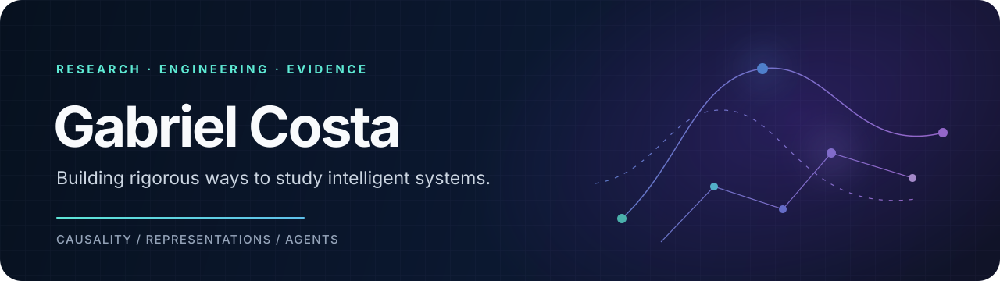

  

  

## Hello — I'm Gabriel

I build research-grade machine learning systems where scientific questions meet reproducible engineering. My current work explores **how internal interventions change model behavior**, **how groups of agents develop specialization**, and **how AI systems should reason about reused evidence**.

My path into ML runs through computational physics, time series, computer vision, and a persistent fascination with music. I care about experiments that are auditable, claims that match the evidence, and failures that teach us something.

> **My default:** make the claim smaller, the experiment sharper, and the evidence harder to fool.

## Questions I'm working on

| | Research thread | The question |
|:--:|---|---|
| ◇ | **Causal geometry** | Can controlled activation interventions create useful, competence-preserving changes in where a language model fails? |
| △ | **Emergent specialization** | Can initially identical LLM agents develop persistent and useful roles from different feedback histories? |
| ○ | **Evidence provenance** | Can research agents recognize when many reports descend from the same underlying source? |

## Selected work

- **[Causal Geometry of Epistemic Complementarity](https://github.com/ACS-USP/causal-epistemic-geometry)** — a staged, audit-first research program for causal activation interventions and semantic error complementarity in frozen language models.
- **[Emergent Specialization](https://github.com/costaleirbag/emergence-specialization)** — controlled experiments on whether homogeneous agents can develop functional differentiation through asymmetric experience.
- **[Recycled Evidence](https://github.com/costaleirbag/recycled-evidence)** — exact provenance-aware foundations for studying evidence double-counting in RAG, debate, and recursive synthesis.
- **[Saguis × DINOv3](https://github.com/costaleirbag/saguis-dinov3)** — a multimodal computer-vision pipeline combining image embeddings, geospatial context, and tabular features for marmoset classification.

## Tools I reach for

  
  
  
  
  
  

Also at home with NumPy, pandas, Transformers, pytest, Git, experiment design, and the occasional music-theory rabbit hole.

---

  <i>Physics taught me to look for invariants. Machine learning taught me how interesting the exceptions can be.</i>

